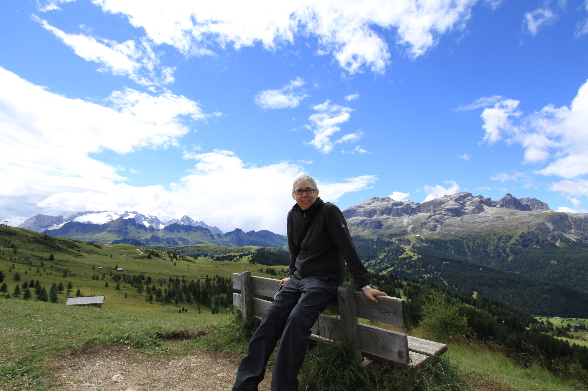

I'm a Ricercatore Universitario at the [Department of Management and Engineering](http://www.gest.unipd.it/) of the [University of Padua](http://www.unipd.it), Italy. It is a research-oriented permanent position at the assistant professor level. 

  

 

Before doing so, I was a PhD student at the [University of Parma](http://www.unipr.it), a visiting scholar at the [Los Alamos National Laboratory](http://www.lanl.gov), a research associate at the [University of Parma](http://www.unipr.it) and at the [University of Verona](http://www.univr.it), and a visiting professor at the [University of Applied Sciences Bonn-Rhein-Sieg](https://www.h-brs.de/). After, I was a visiting researcher at the [School of Sport Science, Exercise and Health](http://www.sseh.uwa.edu.au/) of [The University of Western Australia](http://www.uwa.edu.au/) (Summer 2010), at the [Department of Neurorehabilitation Engineering](http://www.neurorehabilitation-systems.de/) of the [Universitätsmedizin Göttingen Georg-August-Universität](http://www.med.uni-goettingen.de) (Summer 2012), and at the Centre for Musculoskeletal Research of the [Griffith University](https://www.griffith.edu.au) (Summer 2014).
I'll always procrastinate updating my web site. Please see my curriculum vitae for more biographical information and my [publications]({{ BASE_PATH }}/pages/pubs.md) for more research information.

The focus of my research is on autonomous systems. I have a broad interest in several aspects of human robot collaboration, algorithms, and software architectures for robotics applications. In the latest years, I started working on neuromuscular human-machine interfaces, an interesting topics which has quickly become my core research interest. Latest bit of information: I do love to code in my spare time.

If you want to get in touch with me, here for smail, email, gtalk, skype, ... [contacts]({{ BASE_PATH }}/pages/contacts.md).
